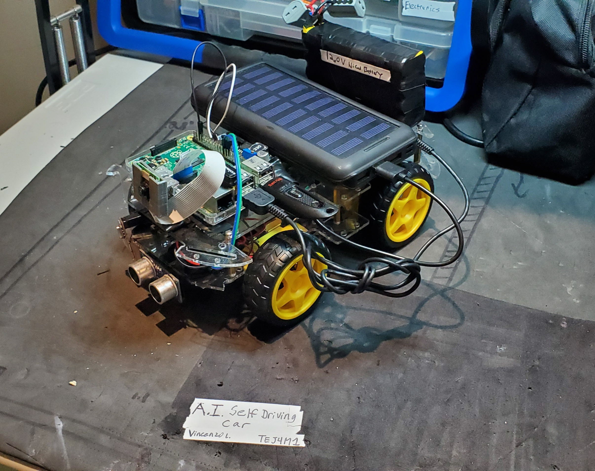

# RASPI-OpenCV-Self-Driving-Car
----WORK IN PROGRESS----

I am trying something new. For my final project for grade 12 computer engineering, I wanted to make a self driving car.
We needed to use the pi and code using python 3.

I saw a youtube video of someone doing this but using C and java??
I used OpenCV with the Pi camera to do very basic lane tracking and partial stop sign detection.
I am using Sklearn's neural network and used and edited lots of OpenCV code to work

I will post more file once I fix a few things. 
NOTE: most of the python code I did not do. I dont know much about image and ai stuff yet
      all arduino code was written by me.
